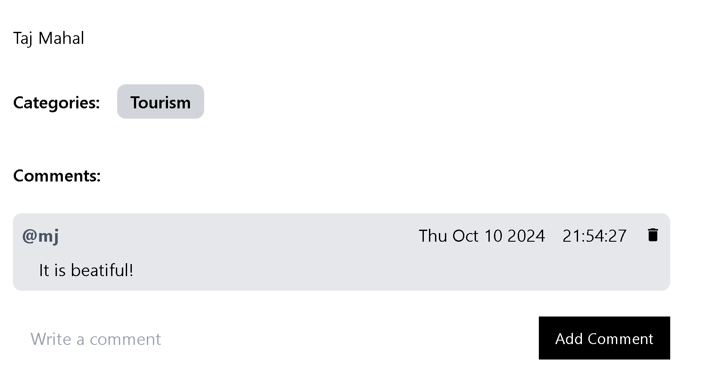
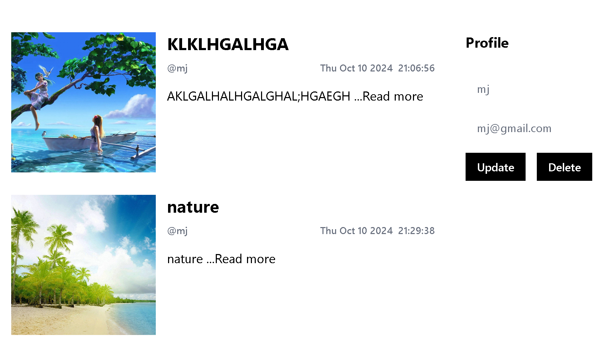
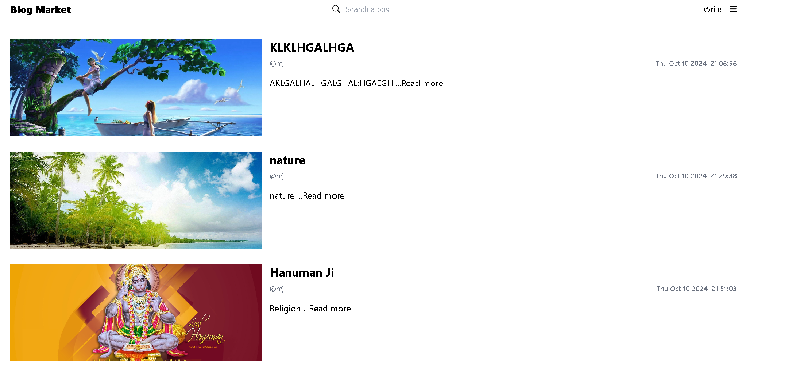

# Blogging App (MERN Stack)

A full-featured blogging application built with the MERN stack (MongoDB, Express.js, React, and Node.js) that allows users to create, edit, delete, and view blog posts. The app also includes authentication features like user login, logout, and registration.

## Table of Contents

- [Features](#features)
- [Technologies Used](#technologies-used)
- [Installation](#installation)
- [Environment Variables](#environment-variables)
- [Running the App](#running-the-app)
- [API Endpoints](#api-endpoints)
- [Project Structure](#project-structure)
- [Screenshots](#screenshots)

## Features

- User authentication: Register, login, and logout
- JWT-based authentication with protected routes
- CRUD operations on blog posts:
  - **Create** a new blog post
  - **Edit** an existing blog post
  - **Delete** a blog post
  - **View** a list of all blog posts
- User can only edit and delete their own posts
- Image upload functionality for blog posts
- Responsive UI design
- Comment functionality on posts

## Technologies Used

### Frontend:

- React.js
- Axios for API calls
- React Router DOM for routing
- TailwindCSS for styling

### Backend:

- Node.js
- Express.js
- MongoDB & Mongoose for database
- JWT for authentication
- Bcrypt for password hashing
- Multer for image uploads
- Cookie-Parser for handling JWT tokens in cookies

## Installation

To run this project locally, follow these steps:

### 1. Clone the repository:

```bash
git clone https://github.com/Coding-Meri-Jaan/Blogging-App.git
cd Blogging-App
```

### 2. Install dependencies:

#### For the backend:

```bash
cd Backend
npm install
```

#### For the frontend:

```bash
cd Frontend
npm install
```

## Environment Variables

Create a `.env` file in the `backend` directory and add the following:

```
PORT=5000
MONGO_URL=your_mongo_connection_url
SECRET=your_jwt_secret
```

## Running the App

### 1. Start the Backend Server:

```bash
cd backend
nodemon index.js
```

### 2. Start the Frontend (React) Server:

```bash
cd frontend
npm run dev
```

The frontend will be running on `http://localhost:5173` and the backend on `http://localhost:5000`.

## API Endpoints

### Authentication Routes:

- `POST /api/auth/register` - Register a new user
- `POST /api/auth/login` - Login a user and get a JWT token
- `GET /api/auth/logout` - Logout the user by clearing the JWT token
- `GET /api/auth/refetch` - Refetch user data using a valid JWT token

### Post Routes:

- `POST /api/posts` - Create a new post
- `PUT /api/posts/:id` - Update a post (requires authentication)
- `DELETE /api/posts/:id` - Delete a post (requires authentication)
- `GET /api/posts` - Get all posts
- `GET /api/posts/:id` - Get a specific post by ID

### Comment Routes:

- `POST /api/comments` - Create a comment on a post
- `GET /api/comments/:postId` - Get all comments for a post

### Image Upload:

- `POST /api/upload` - Upload an image

## Project Structure

```bash
├── backend
│   ├── models         # Mongoose models (User, Post, Comment)
│   ├── routes         # Express routes (auth, posts, comments)
│   ├── images         # Uploaded images folder
│   ├── .env           # Environment variables
│   ├── index.js      # Main entry point for backend server
│   └── ...
├── frontend
│   ├── src
│   │   ├── components # Reusable components (Header, Footer, etc.)
│   │   ├── pages      # React pages (Home, Login, Register, Post, etc.)
│   │   ├── App.jsx    # Main App component
│   │   └── index.js   # React entry point
│   └── ...
├── README.md          # Project README
└── package.json       # Project dependencies and scripts
```

## Screenshots







